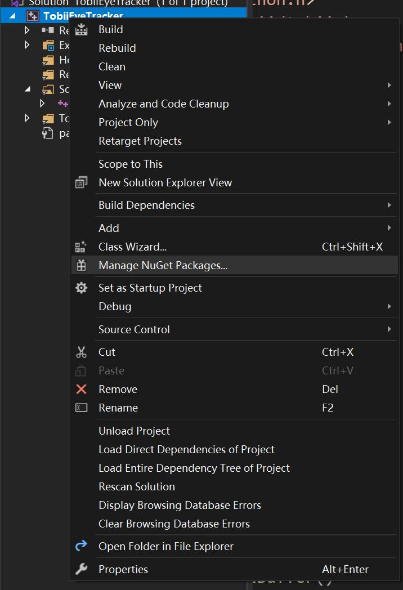
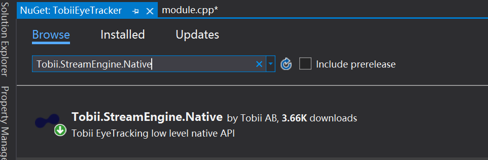

# PyEyetracker
A python interface for the Tobii Eye Tracker

## Usage
1. Download the .dll and .pyd file to your project python folder
2. ```from EyeTracker import init, getBuffer```
3. Take a look at example.py

## Requirement
1. Windows 10
2. Python 3.7 32-bit (32 instead of 64!)
3. Visual Studio 2019
4. Tobii Native Stream Engine

## Develop more
I only use a small portion of Tobii-provided SDKs. If you want develop more function, this part might be helpful.
I develop this API follow the code of \[1\] and \[2\]. My experience is: download Tobii Native Stream Engine 
using Nuget in Visual Studio.



Then Follow the setup at \[1\].

## References
1. https://docs.microsoft.com/en-us/visualstudio/python/working-with-c-cpp-python-in-visual-studio?view=vs-2019
2. https://vr.tobii.com/sdk/develop/native/stream-engine/api/
