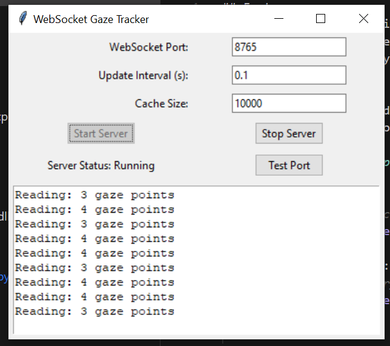

# PyEyetracker
A Python interface for the Tobii Eye Tracker. Supports GUI and websocket server.


## Features
- Support for both 32-bit and 64-bit (massive improvement, guys!) Python environments.
- Easy-to-use GazeTracker class for 64-bit applications compare to V1.
- Backward compatibility with the original 32-bit EyeTracker interface

## Usage Methods

### 1. WebSocket GUI

Download the executable GazeServer.exefrom the releases page and run it. This provides a graphical interface and WebSocket server.

**Python Client Example:**
```python
import asyncio
import websockets
import json

async def connect_to_gaze_tracker():
    uri = "ws://localhost:8765"  # Match your server port
    
    try:
        async with websockets.connect(uri) as websocket:
            print("Connected to Gaze Tracker Server")
            
            while True:
                # Receive gaze data
                data = await websocket.recv()
                gaze_data = json.loads(data)
                
                # Process the data
                print(f"Gaze Position: X={gaze_data['x']:.2f}, Y={gaze_data['y']:.2f}")
                print(f"Timestamp: {gaze_data['timestamp']}")
                
    except websockets.exceptions.ConnectionClosed:
        print("Connection to server closed")
    except Exception as e:
        print(f"Error: {e}")

# Run the client
asyncio.get_event_loop().run_until_complete(connect_to_gaze_tracker())
```
**Node.js Client Example:**
```javascript
const WebSocket = require('ws');

function connectToGazeTracker() {
    const ws = new WebSocket('ws://localhost:8765');

    ws.on('open', () => {
        console.log('Connected to Gaze Tracker Server');
    });

    ws.on('message', (data) => {
        const gazeData = JSON.parse(data);
        console.log(`Gaze Position: X=${gazeData.x.toFixed(2)}, Y=${gazeData.y.toFixed(2)}`);
        console.log(`Timestamp: ${gazeData.timestamp}`);
    });

    ws.on('close', () => {
        console.log('Connection closed. Attempting to reconnect...');
        setTimeout(connectToGazeTracker, 5000);
    });

    ws.on('error', (error) => {
        console.error('WebSocket error:', error);
    });
}

// Start the client
connectToGazeTracker();
```

### 2. WebSocket Command Line

Run the WebSocket server from the command line:
   ```
   python WebSocketServer.py
   ```
### 3. Python Package

For 64-bit applications, use the new GazeTracker class:
   ```python
    from GazeTracker import GazeTracker
    import time

    # Start the eye tracker
    tracker = GazeTracker()

    for i in range(100):
        # Read data every second, result is a list of tuples (x, y)
        print(tracker.get_movement())
        time.sleep(1)
   ```
## Installation

### For Python Package:
1. Ensure you have Python installed (32-bit or 64-bit)
2. Install required dependencies:
   ```
   pip install pywin32 websockets
   ```
3. Copy `TobiiEyeTracker.pyd`, `tobii_stream_engine.dll`, `GazeTracker.py`, and `_listener_win32.py` into your project directory
4. Set up the `PYTHON_32BIT` path in `GazeTracker.py`

### For WebSocket Command Line 
1. install python 32bit (if you are using conda, try: `set CONDA_SUBDIR=win-32` and `conda create -n py32 python=3.7`)
2. install pywin32: `pip install pywin32 websockets`


## Development using c++
To develop additional functions, follow these steps:
1. Download Tobii Native Stream Engine using NuGet in Visual Studio
   - Open Package Manager Console
   - Search for "Tobii.StreamEngine" and install the package (This can no longer be done becase Tobii decided to sell its pro line for more money)
2. Follow the setup instructions in the [Visual Studio C++/Python integration guide](https://docs.microsoft.com/en-us/visualstudio/python/working-with-c-cpp-python-in-visual-studio?view=vs-2019)
3. Refer to the [Tobii Stream Engine API documentation](https://vr.tobii.com/sdk/develop/native/stream-engine/api/) for available functions and usage

## References
1. [Visual Studio C++/Python integration guide](https://docs.microsoft.com/en-us/visualstudio/python/working-with-c-cpp-python-in-visual-studio?view=vs-2019)
2. [Tobii Stream Engine API documentation](https://vr.tobii.com/sdk/develop/native/stream-engine/api/)

## License
See the [LICENSE](LICENSE) file for details.